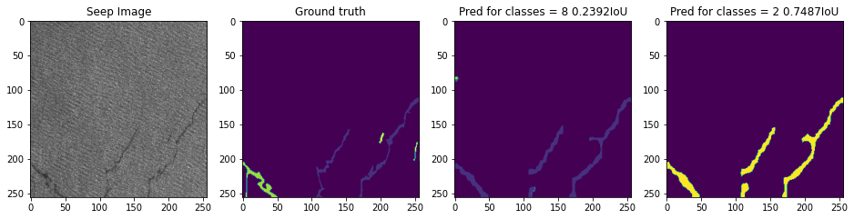

# OilSeepsSegmentation

Used a pre-trained deeplabv3-resnet101 model and fine tuned it. 
Loss functions = Weighted cross entropy + soft dice loss + mean iou loss 
0.73 IOU for segmentation of 2 classes 
